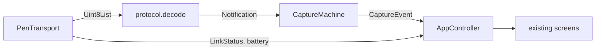

# Phase 2: Live ink

Goal: ink on the Live Capture screen comes from bytes going through the real pipeline, not from `_signatureScript`. On web and in tests the bytes come from a simulator. On phones they come from BLE once the firmware exists.

## 1. Capture: `app/lib/capture/`

Imports only `domain` and `protocol`.

- `sealed class CaptureEvent`, with the subtypes:
  - `StrokeOpened`, `PointAdded`, `StrokeClosed`.
  - `HoverMoved`, `HoverLost`.
  - `PageTurned`, `SamplesLost(count)`.
  - `ReplayStarted`, `ReplayEnded(strokeCount)`.
  - `ProtocolError(reason)`.
- The state is a sealed `Idle`, `Hovering`, or `Drawing(openStroke)`. Every transition is an exhaustive `switch`.
- Rules:
  - A stroke opens on the touching false-to-true edge and closes on the true-to-false edge.
  - A disconnect while `Drawing` closes the open stroke.
  - A page marker acts on its rising edge only. It closes any open stroke first.
  - `seq` is tracked per `boot_id`:
    - A gap emits `SamplesLost(n)`.
    - A duplicate or older `seq` is dropped. BLE retries can resend a packet, so this keeps writes idempotent.
    - A new `boot_id` resets tracking.
  - Time: an offset from device time to wall clock is set from the first live (non-replayed) notification of a boot. Replays from a boot with no offset use arrival time and are marked `approximateTime`.
- Hard caps protect memory from a faulty or hostile device:
  - At most 20,000 points per stroke. When exceeded, the stroke is closed and a new one is opened.
  - At most 5,000 strokes per page.
  - Samples outside the 170 x 107 mm area are clamped.

## 2. Transport: `app/lib/ble/`

Imports only `protocol`.

- `abstract interface class PenTransport`:
  - `Stream<List<FoundPen>> scan()`.
  - `Future<void> connect(String deviceId)`.
  - `disconnect()`, `forget()`.
  - `Stream<Uint8List> notifications`.
  - `Stream<LinkStatus> status`.
  - `Stream<int> battery`.
  - `dispose()`.
- `LinkStatus` is sealed: `Unavailable(reason)` (adapter off, unsupported, or permission denied), `Disconnected`, `Connecting`, `Connected(mtu, rssi)`, or `Reconnecting(attempt)`.
- `SimulatedPenTransport`:
  - Moves the current demo script into here and emits `protocol.encode(...)` bytes at the real cadence of about 16 notifications/s.
  - Scripted scenarios: normal writing, a disconnect with a replay burst, a seq gap, and a page turn.
  - Takes an injected clock and seed, so tests are deterministic.
- `BlePenTransport` uses `flutter_blue_plus`:
  - Scans only with `withServices: [serviceUuid]` and connects only to devices that advertise it.
  - Stores the chosen `remoteId` in secure storage. Auto-reconnect targets only that id; any other device requires an explicit user action.
  - On Android it calls `createBond()` on first connect. Pairing is required: the firmware enforces LE Secure Connections, and the app refuses a stroke characteristic that isn't found under the expected service.
  - Timeouts: 10 s to connect, 5 s for service discovery, 5 s for MTU. Reconnect backoff is 1, 2, 4, 8, 16 s capped at 30 s, with jitter. Every operation is cancelled on `dispose()`.
  - On Android: `requestMtu(185)` and `requestConnectionPriority(high)`. On iOS: read the negotiated MTU.
  - Battery comes from `0x180F` / `0x2A19`: an initial read plus notifications, clamped to 0..100.
- `penTransportProvider` returns the simulator on web and in tests, and BLE on Android and iOS. A debug-only switch allows the simulator on phones. Release builds can't reach the simulator.

## 3. Platform setup

- [app/android/app/src/main/AndroidManifest.xml](app/android/app/src/main/AndroidManifest.xml):
  - `BLUETOOTH_SCAN` with `android:usesPermissionFlags="neverForLocation"`.
  - `BLUETOOTH_CONNECT`.
  - `BLUETOOTH` and `BLUETOOTH_ADMIN` and `ACCESS_FINE_LOCATION`, each with `android:maxSdkVersion="30"`.
  - `<uses-feature android:name="android.hardware.bluetooth_le" android:required="true"/>`.
- [app/ios/Runner/Info.plist](app/ios/Runner/Info.plist): `NSBluetoothAlwaysUsageDescription` in plain language, and `UIBackgroundModes` with `bluetooth-central`.
- `permission_handler` backs `grantPermission()`. A denied or permanently denied permission becomes `LinkStatus.Unavailable`, and the Device screen shows it through the existing copy.

## 4. Wiring: [app/lib/state/app_controller.dart](app/lib/state/app_controller.dart)

- The public methods and `AppModel` stay the same.
- Inside:
  - Subscribes to `transport.notifications`, runs `decode` then `CaptureMachine`, and applies the events to the live page.
  - `PenLink` is derived from `LinkStatus`, battery, and replay events:
    - `Reconnecting` maps to `LinkState.reconnecting`.
    - `queuedStrokes` counts during a replay.
    - The RSSI buckets are: Strong at -65 or higher, Fair down to -80, Weak below that.
  - `SamplesLost` adds a small "N samples lost" marker to the page model. The UI agent can style it later.
  - The timers, `_signatureScript`, and the fake `connectPen` delay are deleted.
- `ref.onDispose` cancels every subscription and disposes the transport.
- The debug overlay shows samples/s, notifications/s, MTU, seq gaps, RSSI, and replay. It sits behind `kDebugMode` and never ships in release builds.

## 5. Tests

- The capture machine has table-driven tests covering every state and input pair: edges, a page marker while drawing, duplicate seq, gap, a new boot_id, replay without an offset, and the caps.
- Widget test: the simulator draws a stroke on Live Capture. The page-turn scenario creates page 2.
- BLE tests use a fake adapter behind a thin wrapper, because `FlutterBluePlus` is static. They cover:
  - Service filtering.
  - Refusing an unknown device on auto-reconnect.
  - Timeout paths.
  - The backoff sequence.
  - Cleanup on dispose.
- `architecture_test.dart` adds two rules: `capture` may import only `domain` and `protocol`, and `ble` may import only `protocol`.

## Done when

- Analyze, format, and tests are clean.
- The web build shows simulated ink flowing through the codec.
- Bluetooth on a real device can't be verified until the firmware's fake-pen mode exists; the PR says so.
